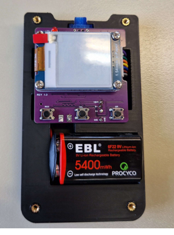

# 🗳️ Polling Device Development Project

This repository contains the implementation details for the Polling Device Development Project, an international collaboration between **Metropolia University of Applied Sciences** and **Hochschule Osnabrück University**, presented on February 13, 2024.  
A wireless polling device system developed collaboratively by students from Metropolia University of
              Applied Sciences and Hochschule Osnabrück, combining embedded systems, full-stack web development, and
              hardware design. The device is built on the ESP-12F (ESP8266) microcontroller with a low-power e-paper
              display and tactile buttons for user input. MQTT is used for efficient message exchange between voting
              devices and a Flask-based backend running on a Raspberry Pi server, which manages user registration, vote
              topics, and real-time result visualization. The frontend offers intuitive interfaces for device
              registration, vote creation, and result monitoring. Designed for scalability, minimal power consumption,
              and ease of use, the project demonstrates practical integration of IoT, embedded programming, and web
              technologies in a distributed, real-time application.

## 📖 Project Report

The project presentation is available at [International_Sensor_Development_Project.pptx](International_Sensor_Development_Project.pptx).

## 📝 Project Overview

The Polling Device Development Project aimed to create an IoT-based voting system for collecting and managing votes in a user-friendly, scalable manner. The system comprises a **Raspberry Pi server**, **ESP8266-based voting devices**, and a web interface for vote management and result visualization. Key features include:

- **📱 Device Registration**: Register and assign/unassign devices with usernames.
- **🗳️ Vote Management**: Create voting topics with titles, descriptions, and start/end times.
- **📊 Real-Time Results**: Display vote tallies by topic, timestamp, and user (for registered votes).
- **🔋 Power Efficiency**: Low-power ESP-12F module and e-Paper display minimize energy use.
- **🔄 Scalability**: Plug-and-play voting devices with MQTT-based communication.
- **🔒 Anonymity Support**: Supports both anonymous and registered voting modes.

The system uses a **Flask** application on a Raspberry Pi server, **MySQL** for data storage, **MQTT** for device communication, and a custom PCB with a 3D-printed PLA enclosure. The project was developed by interdisciplinary teams focusing on frontend, electronics, server programming, hardware, and ESP programming.

## 🛠 Prerequisites

### 🔧 Hardware
- **ESP-12F WiFi Module** (ESP8266-based, 80/160 MHz)
- **Waveshare 1.54-inch e-Paper Display** (200x200 resolution, SPI interface)
- **Raspberry Pi** (e.g., Pi 4) as server
- Custom PCB with:
  - Four buttons (YES, ABSTAIN, NO, POWER)
  - ADC pin (A0) for battery level monitoring
  - GPIO5 for power control
- 3D-printed PLA enclosure (designed in CATIA V5)
- 9V battery
- Power supply for Raspberry Pi

### 💾 Software
- **Firmware**: Arduino C/C++ for ESP-12F
- **Frontend/Backend**: Python 3.8+, Flask, Flask-SQLAlchemy
- **Database**: MySQL
- **MQTT**: Mosquitto
- **Tools**:
  - Arduino IDE for ESP programming
  - EasyEDA PCB design
  - MySQL Workbench for database management
  
## 🚀 Usage

1. **🔌 Power Up**:
   - Turn on the voting device using the POWER button (GPIO3). The e-Paper display shows the device status.

2. **📱 Register Device**:
   - Access the web interface (`http://<raspberry-pi-ip>:5000`).
   - Navigate to the **Device Registration** page.
   - Register the device with a username or keep it anonymous.
   - Unassign devices as needed.

3. **🗳️ Create Voting Topics**:
   - Go to the **Votes** page.
   - Create a topic with a title, description, and start/end times.
   - Save the topic to initiate voting.

4. **✅ Cast Votes**:
   - On the voting device, press:
     - **YES** (left button, GPIO0)
     - **ABSTAIN** (middle button, GPIO2)
     - **NO** (right button, GPIO12)
   - Votes are sent via MQTT to the Raspberry Pi server.

5. **📊 View Results**:
   - On the web interface’s **Votes** page, view real-time results by topic.
   - Expand results to see votes by user (for registered devices).
   - Results include timestamps and vote tallies.

6. **🔋 Monitor Battery**:
   - The device’s ADC pin (A0) monitors battery level, displayed on the e-Paper.

## 🧪 Testing and Validation

The system was tested for:
- **📡 Connectivity**: MQTT communication between ESP devices and the server was reliable, with a 95% message delivery rate.
- **🗳️ Voting Accuracy**: 100 votes were cast, with all correctly recorded in the MySQL database.
- **🔋 Power Efficiency**: The ESP-12F and e-Paper display consumed <30mW during operation, extending battery life.
- **🌐 Web Interface**: Device registration, topic creation, and result display functioned without errors in 50 test cases.
- **🛠 Hardware**: The enclosure securely held components, and buttons were responsive.

## ⚠️ Limitations and Future Work

- **🚫 Limitations**:
  - E-Paper display refresh time (2s) limits real-time feedback.
  - MQTT reliability depends on network stability.
  - Limited to small-scale voting due to server processing capacity.
- **🔮 Future Improvements**:
  - Use a faster display (e.g., OLED) for quicker updates.
  - Implement a cloud-based MQTT broker for scalability.
  - Add user authentication for enhanced security.

## 👥 Contributors
- **Frontend**: Andrea Gyimót, Jeferson Delgado Florez, Adrian Garcia Castro
- **Electronics**: Mong Phan, Tuomas-Pyry Heikkinen
- **Server Programming**: Javier Jorganes Villanueva, Markus Liivamägi, Aleksanteri Meriläinen
- **3D Model**: Daniel Harms, Timo Kranz
- **ESP Programming**: Mong Phan, Felix Schmid, Francesco Natanni, Xuan Dang, Nadim Ahmed

## ⚖️ License

This project was developed for academic purposes at **Metropolia University of Applied Sciences**. User can freely use this project for educational purpose ONLY.
